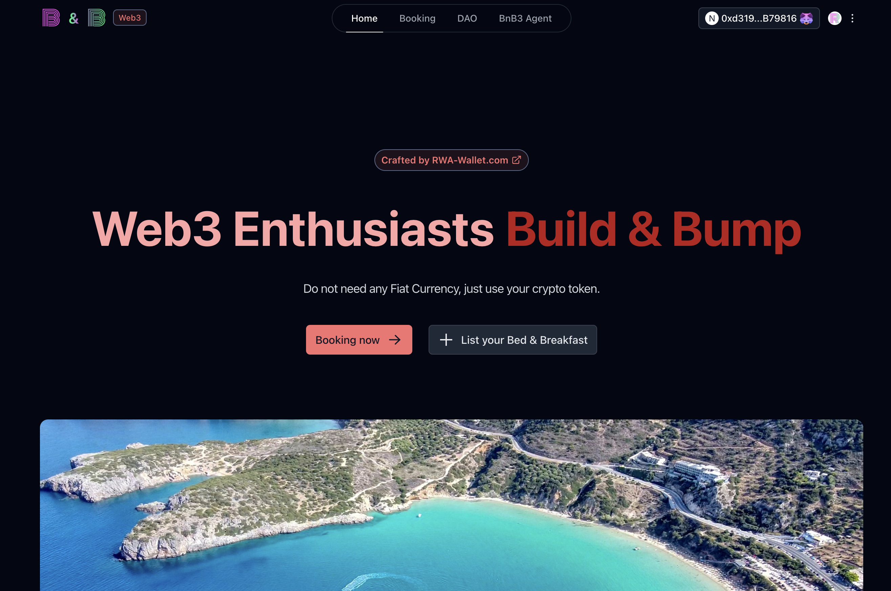
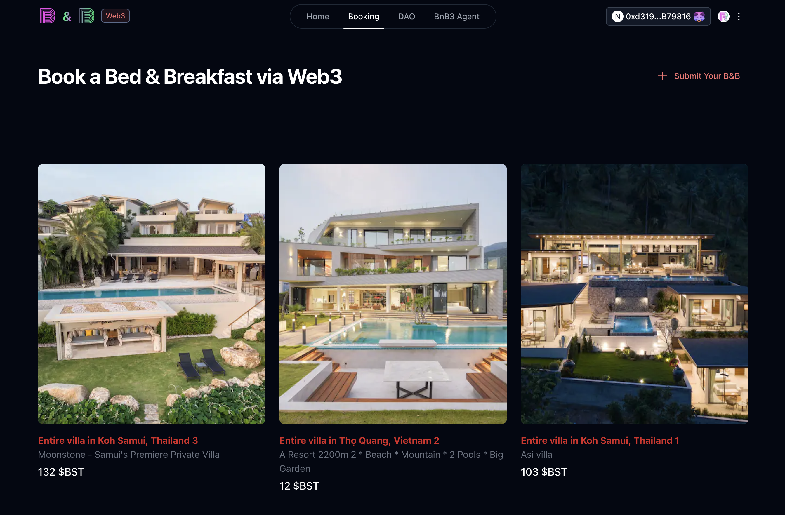
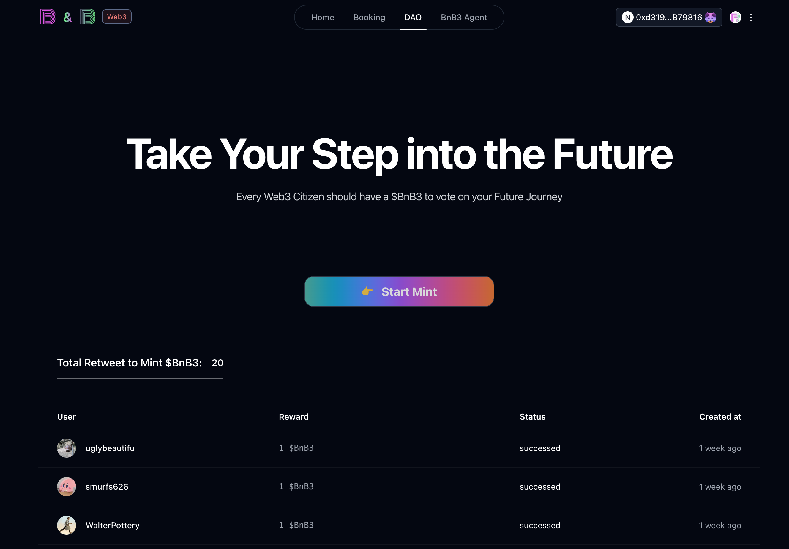

# BnB3DAO

## Links

- codebase: https://github.com/HelloRWA/neox-hackathon
- video demo: https://www.loom.com/share/786890e49d1544168d6220edf95b6127?sid=f9e9b242-83d4-4fbf-bfe3-2c8df7c3d094
- online demo: https://neox-t4-bnb3.rwa-wallet.com/dao
- contract deployment on testnet: https://xt4scan.ngd.network/address/0xeF50F44EEe74195b252d257B102f54D2b368Ce65
- contract deployment on mainnet: https://xexplorer.neo.org/address/0xC6E58fb4aFFB6aB8A392b7CC23CD3feF74517F6C
- community OKR list: https://github.com/BnB3DAO/Press-Conference/issues

## Introduction

BnB3 (Bed & Breakfast Web3) at the very beginning is a decentralized hotel platform that revolutionizes short-term property rentals using blockchain technology.

But seems we can not beat AirBnB in the market.

So now we change into a web3 developer community that will provide guide to new web2 developers to join the web3 world.

Since 2024/11, we have growth 250+ members in our community.

We will provide web3 project practice guide and hackerhouse experience for new web2 developers to join the web3 world more easily.

Key Features:

- Decentralized booking system with smart contract-powered reservations
- Property listing and management system for hosts
- Secure guest verification and booking process
- Automated payment settlements and refund handling

Technical Stack:

- Smart contracts deployed on testnet
- Web3 frontend for seamless user interaction
- Decentralized storage for property details and user data

The platform aims to bring the benefits of blockchain technology to the hotel sector, offering reduced fees, increased transparency, and automated trust mechanisms for both hosts and guests.

## Goals after the hackathon

- Launch BnB3DAO on mainnet
- Find more support from chain to host hackerhouse
- Add more features to BnB3DAO such as [OKR list](https://github.com/BnB3DAO/Press-Conference/issues)
- Partner with existing hackerhouse for wider adoption

